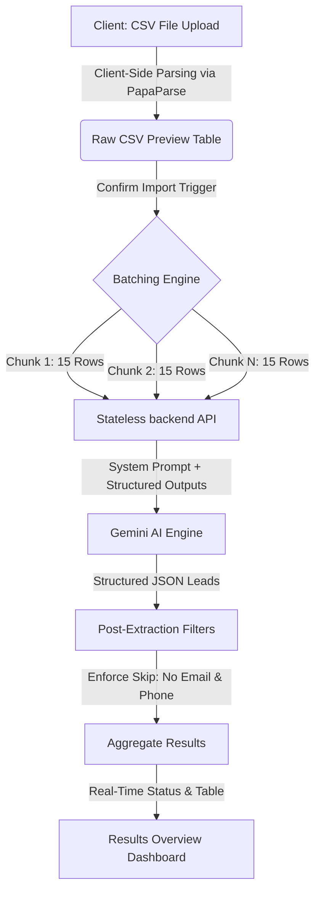

# AI-Powered CSV Importer

An intelligent, stateless CSV importer designed to clean, normalize, and map arbitrary lead spreadsheets (Facebook exports, Google Ads sheets, custom CRM databases) into a standardized CRM Lead schema using Gemini AI.

---

## 🏗️ Architecture & Data Flow



---

## 🌟 Key Features

1. **Intelligent Field Mapping**: Automatically identifies and maps varying headers (e.g. `Full Name`, `Contact E-mail`, `Organization`) into target CRM schema fields.
2. **Stateless Backend**: Processing is entirely stateless, using memory buffers for Multer and direct API pipes. No persistent database is required.
3. **Structured Outputs**: Guarantees output conformance by supplying OpenAPI 3.0 response schemas directly to the Gemini API.
4. **Client-Side Batching Wizard**: Chunks massive files into uniform payloads of 15 rows, preventing gateway timeouts and displaying real-time batch percentages.
5. **Robust Exponential Backoff**: Automatically handles transient network dropouts and rate limits (HTTP 429) using randomized delays.
6. **Strict Skipping Logic**: Excludes any lead record containing neither a valid email address nor a mobile number.
7. **Premium UI Dashboard**: Built with a gorgeous deep-slate visual theme, sticky table headers, and an interactive Results view (Imported vs. Skipped tabs) with Excel/CSV export capabilities.

---

## 📋 Target CRM Schema

| Field Name | Type | Description | Mapping Rules |
| :--- | :--- | :--- | :--- |
| `created_at` | `string` | Lead creation timestamp | Normalize to `YYYY-MM-DD HH:mm:ss` or ISO. |
| `name` | `string \| null` | Full name | Concat first/last names. |
| `email` | `string \| null` | Primary email address | First email only. Extra emails appended to `crm_note`. |
| `country_code` | `string \| null` | Dialing code | Standard country code prefix (e.g., `+91`). |
| `mobile_without_country` | `string \| null` | Mobile number | Exclude country code. Extra numbers appended to `crm_note`. |
| `company` | `string \| null` | Company name | Mapped from source company/org. |
| `city` / `state` / `country` | `string \| null` | Geographics | Normalised locations. |
| `crm_status` | `string \| null` | Validation Status | Clamped to: `GOOD_LEAD_FOLLOW_UP`, `DID_NOT_CONNECT`, `BAD_LEAD`, `SALE_DONE`. |
| `crm_note` | `string \| null` | Aggregated details | Holds extra emails, phones, and unmapped column values. |
| `data_source` | `string \| null` | Lead Source Tag | Clamped to: `leads_on_demand`, `meridian_tower`, `eden_park`, `varah_swamy`, `sarjapur_plots`. |
| `possession_time` | `string \| null` | Property Timeline | Target timeline for real estate needs. |
| `description` | `string \| null` | Remarks | Additional remarks (escapes embedded newlines with `\n`). |

---

## ⚡ Quick Start (Docker Compose)

The easiest way to boot the complete stack (Frontend on `:3000`, Backend on `:5000`) is using Docker Compose.

```bash
# 1. Clone the repository and navigate to root directory
cd csv_aiact

# 2. Start all services in the background
docker-compose up --build -d

# 3. Verify services are up
docker-compose ps
```

- **Frontend Wizard**: Access at [http://localhost:3000](http://localhost:3000)
- **Backend API Health**: Check at [http://localhost:5000/api/health](http://localhost:5000/api/health)

---

## 🛠️ Local Development (Manual Startup)

If you wish to run the packages locally for development:

### 1. Start the Backend API
```bash
cd backend
npm install
npm run dev
```
*Note: Make sure your `GEMINI_API_KEY` is present in a `.env` file or exported in your environment. A default fallback key is provided in config.*

### 2. Start the Next.js Frontend
```bash
cd ../frontend
npm install
npm run dev
```
*The React app starts at [http://localhost:3000](http://localhost:3000) and communicates with the backend on `localhost:5000`.*

---

## 🧪 Testing with Sample Datasets

We have supplied two sample datasets under `/sample-data` to test the importer:
1. **`groweasy_native.csv`**: A clean reference CSV containing already mapped columns.
2. **`facebook_messy_export.csv`**: A highly messy dataset featuring arbitrary headers, missing values, multiple email addresses, multiple phone numbers, and invalid records (e.g. Row 5 has no email/phone and should be skipped).

---

## 🤖 Prompt Engineering & AI Architecture

The importer leverages Gemini's structured response model to perform reliable zero-shot mapping:
- **Low Temperature (0.1)**: Keeps mappings deterministic and reduces hallucinations.
- **Enforced JSON Schema**: Using Gemini's `responseSchema` configuration guarantees that the response from the LLM is a validated JSON array conforming to `CRMLead[]` without markdown blocks.
- **Lossless Note Mapping**: System instructions mandate that any unmapped CSV column header and its value are serialized and written into `crm_note` as key-value pairings (e.g., `[Original Column Name: Value]`).
